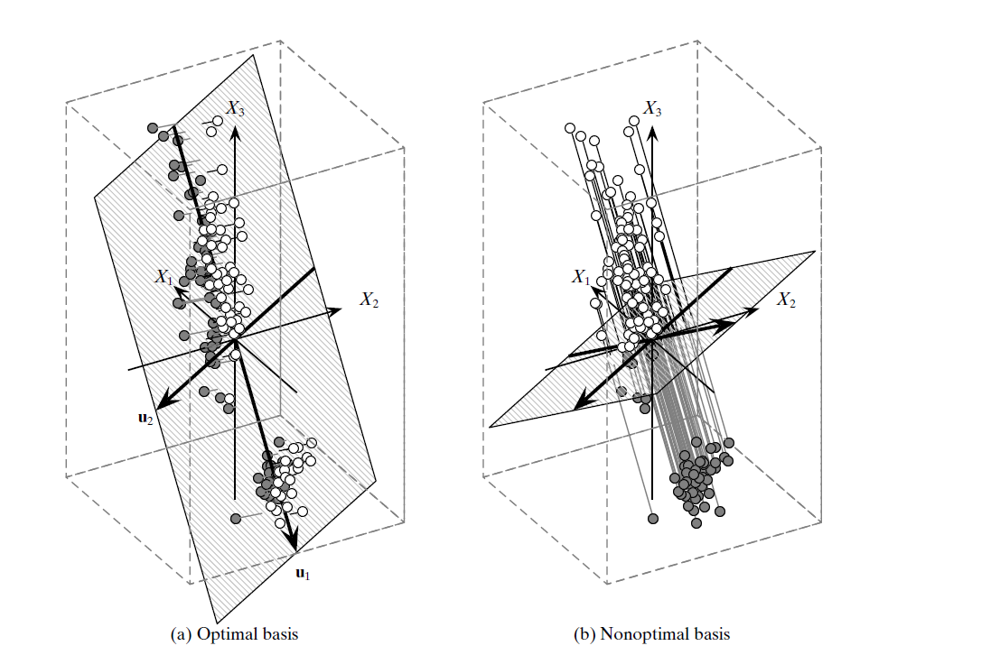

# Dimensionality-Reduction
Implementing Dimensionality reduction algorithms like PCA and LDA and evaluating accuracy after applying with application.

## PCA

  

### Intuition:
Principal Component Analysis (PCA) is an algorithm used for dimensionality reduction and feature extraction. It works by identifying the directions, or principal components, in the data that capture the maximum variance. These principal components are orthogonal to each other, meaning they are uncorrelated, and they are ranked by the amount of variance they explain. By selecting a subset of the top-ranked principal components, PCA effectively reduces the dimensionality of the data while preserving the most important information. This reduction in dimensionality can lead to simpler models, faster computation, and improved performance in tasks such as classification or clustering. However, it's important to note that PCA assumes linear relationships in the data and may not always be suitable for datasets with non-linear structures. Additionally, interpreting the transformed features in terms of the original features can sometimes be challenging.

### Implementation approach:
In the realm of Principal Component Analysis (PCA), my role is to supply the algorithm with the dataset, alongside a pivotal parameter referred to as alpha. This parameter, alpha, acts as a guiding beacon, directing the algorithm's focus towards selecting the principal components that hold paramount importance, encapsulating the utmost information and variance present within the dataset. Through this collaborative process, PCA endeavors to distill the essence of the data, uncovering its underlying patterns and structures for insightful analysis and interpretation.

### Cases of usage:
PCA is particularly useful when dealing with unlabeled datasets. In such cases, it serves as an unsupervised learning technique, allowing for dimensionality reduction and feature extraction without relying on labeled data.

## LDA

  

### Intuition:
Linear Discriminant Analysis (LDA) is an algorithm used for dimensionality reduction and feature extraction, particularly in the context of supervised learning tasks such as classification. It aims to find a set of linear combinations of features that maximize the separation between different classes in the data. LDA achieves this by considering both the within-class scatter and between-class scatter of the data. By transforming the original feature space into a new space with reduced dimensionality, LDA helps improve class separability and enhances the performance of classification algorithms. However, similar to PCA, LDA assumes linear relationships in the data and may not be suitable for datasets with complex nonlinear structures.

### Implementation approach:
I begin by receiving the dataset along with their respective class labels. This information helps guide the algorithm in its task of reducing dimensions effectively. Unlike PCA, LDA relies on labeled data, using it to identify features that make classes distinct from each other. By analyzing these class differences, LDA transforms the original feature space into a new one where it maximizes the separation between classes. This transformation aims to improve the accuracy of classification tasks by making class boundaries clearer and more distinguishable.

### Cases of usage:
LDA is particularly valuable in scenarios where labeled data is available and the goal is to enhance class separability for classification tasks. It finds applications in various fields such as pattern recognition, image processing, and bioinformatics. Additionally, LDA can be employed in feature extraction and data visualization tasks to uncover meaningful patterns and relationships between classes in the data.

# Acknowledge:
The referenced material used in this project/repository is derived from "Data Mining and Analysis: Fundamental Concepts and Algorithms" authored by Mohammed J. Zaki and Wagner Meira Jr., affiliated with Rensselaer Polytechnic Institute, Troy, New York, and Universidade Federal de Minas Gerais, Brazil, respectively. The content has been utilized appropriately, with due credit given to the original authors, and is included here for reference purposes. All rights pertaining to the material belong to the original creators.

# Contact me:
<!-- contact me -->

      <!-- linkedin -->
       
      &nbsp; &nbsp; &nbsp;
      <!-- gmail -->
      

